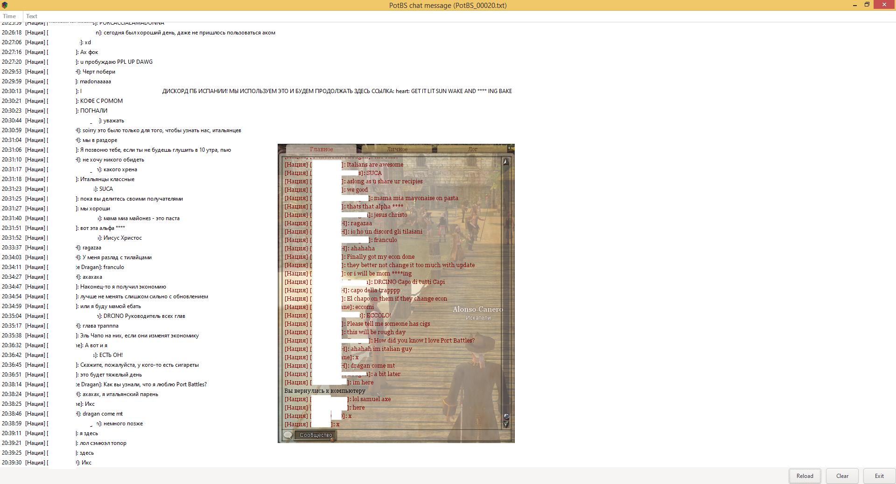

# PotBS-Chat
Перевод сообщений чата PotBS на Русский язык

Программа считывает лог игры и выводит переведенные сообщения чата.  
Сообщения переводятся через Google Translate, при недоступности через Libre Translate.  


Написана на [Go](https://golang.org/) с использованием [gotk3](https://github.com/gotk3/gotk3)

## Установка
1. Скачать [актуальный релиз](https://github.com/SnakeSel/PotBS-Chat/releases)  
Для версии **without GTK3** необходимо установить [GTK+ for Windows Runtime Environment](https://github.com/tschoonj/GTK-for-Windows-Runtime-Environment-Installer) (один раз для всех GTK приложений).
2. Распаковать архив
3. Для работы необходимо в директории игры в файле `pirates_local.ini` (создать при отсутствии) прописать следующие строки:
```
[Logger]
Chat_Messages=Info
```

## Запуск ##
Запустить:
- Windows: `PotBS-Chat.exe`
- Linux: `./PotBS-Chat`

По умолчанию лог игры расположен в по пути: `%USERPROFILE%/Documents/Pirates of the Burning Sea/log`  
Именно там программа ищет файлы.  
Если вы меняли расположение папки документов, то запускайте программу с указанием директории логов:  
```
PotBS-Chat.exe "D:/Documents/Pirates of the Burning Sea/log"
```
### Внимание ###
Т.к. при запуске программа открывает последний лог файл, а игра при запуске создает новый лог, то 
программу следует запускать ПОСЛЕ запуска игры. Или после запуска игры нажать кнопку "reload".

## Сборка из исходников
#### Необходимо установить пакеты разработки GTK3:
- Windows: [msys2](https://www.gtk.org/docs/installations/windows/#using-gtk-from-msys2-packages) или [Chocolatey](https://github.com/gotk3/gotk3/wiki/Installing-on-Windows)
- [Linux](https://github.com/gotk3/gotk3/wiki/Installing-on-Linux)

#### Download PotBS-Chat:
```sh
$ go get github.com/SnakeSel/PotBS-Chat
```
#### Go to the PotBS-Chat directory:
```sh
$ cd $GOPATH/src/github.com/snakesel/PotBS-Chat/
```
#### Build:
- Windows: `Build.bat` or `go build -ldflags "-H=windowsgui -s -w"`
- Linux: `go build -ldflags "-s -w"`

