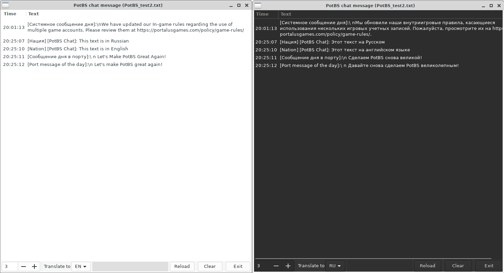

# PotBS-Chat

[Русская версия](README.md) 🇷🇺

Translating PotBS Chat Messages into English

The program reads the game log and displays the translated chat messages.  
Messages are translated via Google Translate, if not available via Libre Translate.  


Written in [Go](https://golang.org/) using [gotk3](https://github.com/gotk3/gotk3)


## Install and run
1. Download [release](https://github.com/SnakeSel/PotBS-Chat/releases)  
Для версии **without GTK3** необходимо установить [GTK+ for Windows Runtime Environment](https://github.com/tschoonj/GTK-for-Windows-Runtime-Environment-Installer) (один раз для всех GTK приложений).
2. Unpack
3. Needed in the game directory in the file (create in the absence) `pirates_local.ini` write the following lines: 
```
[Logger]
Chat_Messages=Info
```
4. Run:
- Windows: `PotBS-Chat.exe`
- Linux: `./PotBS-Chat`

### Attention ###
Because at startup, the program opens the last log file, and the game creates a new log at startup, then 
the program should be launched AFTER starting the game. Or after starting the game, press the "reload" button. 

## Build from sourse
#### You need to install GTK3 development packages:
- Windows: [msys2](https://www.gtk.org/docs/installations/windows/#using-gtk-from-msys2-packages) or [Chocolatey](https://github.com/gotk3/gotk3/wiki/Installing-on-Windows)
- [Linux](https://github.com/gotk3/gotk3/wiki/Installing-on-Linux)

#### Download PotBS-Chat:
```sh
$ git clone https://github.com/SnakeSel/PotBS-Chat
```
#### Go to the PotBS-Chat directory:
```sh
$ cd PotBS-Chat
```
#### Build:
- Windows: `Build.bat` or `go build -ldflags "-H=windowsgui -s -w"`
- Linux: `go build -ldflags "-s -w"`

